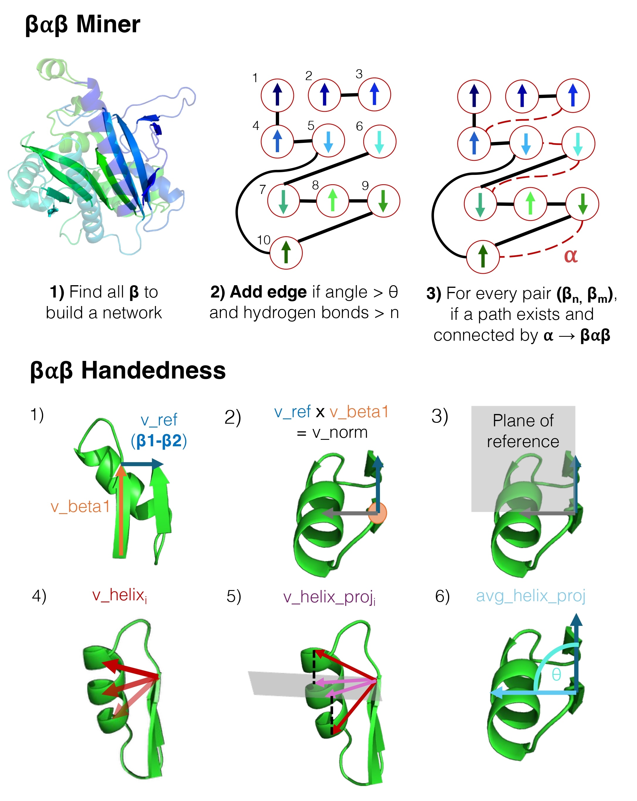

# BABMiner: β-α-β Protein Motif Tool

A Python tool for identifying and extracting β-α-β (beta-alpha-beta) protein motifs from PDB files.

## Features

- **Motif detection**: Identifies beta-alpha-beta structural patterns in proteins
- **Parallel processing**: Process multiple PDB files concurrently
- **Fragment extraction**: Automatically extracts and saves motif fragments:
  - PDB structure files (`fragments_pdb/`)
  - FASTA sequences (`fragments_fasta/`)
  - Metadata CSV (`metadata.csv`)
- **Rich analysis**: Secondary structure, hydrogen bonding, strand orientation, handedness, sequence coverage


## Algorithm Overview



## Installation

```bash
git clone https://github.com/AndreLecona/BABMiner.git
cd BABMiner
pip install -e .
```

## Quick Start
### Analyze a single PDB file

```bash
BABMiner protein.pdb --outdir results
```

### Analyze a multiple PDB files in parallel

```bash
BABMiner /path/to/pdbs --outdir results --processes 8
```

## Command-Line Options

```
positional arguments:
  input                 PDB file or directory containing PDB files

optional arguments:
  -o, --outdir DIR      Output directory (required)
  -p, --processes N     Parallel processes (default: auto-detect)
  --angle DEGREES       Angle threshold (default: 40)
  --min_hb N           Minimum H-bonds (default: 2)
  -v, --verbose        Enable verbose output
  -h, --help           Show help
```

## Output

Running BABMiner creates:

```
results/
├── fragments_pdb/          # PDB structure files
│   ├── 1abc_1.pdb
│   └── ...
├── fragments_fasta/        # Amino acid sequences
│   ├── 1abc_1.fasta
│   └── ...
└── metadata.csv            # Motif metadata
```

### CSV Columns

| Column | Description |
|--------|-------------|
| **identifier** | Unique BAB motif identifier in the format `pdbid_{index}`, where the index corresponds to the order of appearance in the protein sequence |
| **uid** | Source PDB file identifier |
| **chain** | Protein chain identifier from the structure |
| **motif_type** | Number of intervening β-strands between **β1** and **β2** plus one. This corresponds to the number of steps in the shortest path between the strands in the β-sheet network |
| **beta1** | Residue range of the first β-strand (β1), using PDB residue indexing |
| **beta2** | Residue range of the second β-strand (β2), using PDB residue indexing |
| **h&l_len** | Total length of helices and loops within the BAB motif |
| **length** | Total length of the BAB motif in residues |
| **res_bonded** | Number of residues forming β-sheet hydrogen-bond connections along the network path between β1 and β2 |
| **angles** | Angles between β-strands along the path in the β-sheet network between β1 and β2 |
| **orientation** | Strand orientation: `parallel` or `antiparallel` |
| **handedness** | Handedness classification: `right`, `left`, or `unknown` |
| **angle** | Mean signed angle of the helix vector used to determine handedness (parallel motifs only) |
| **dssp** | DSSP secondary structure annotation corresponding to the BAB region |
| **exp_method** | Experimental structure determination method (e.g., X-RAY, NMR, cryo-EM) |
| **coverage** | Fraction of the protein sequence that is composed of BAB motifs |

## Python API

```python
from BABMiner import bab_finder
from BABMiner.utils import load_pdb_structure

# Load structure
structure, model = load_pdb_structure('protein.pdb')
from Bio.PDB import DSSP
dssp = DSSP(model, 'protein.pdb')

# Find motifs
motifs, coverage = bab_finder(dssp, model, angle_threshold=40, min_bonds=2)

for motif in motifs:
    print(f"Chain {motif['chain']}: {motif['orientation']}")
```

## License

GNU General Public License v3 (see LICENSE file)

## Contributing

Contributions welcome! Please fork, add features, and submit pull requests.